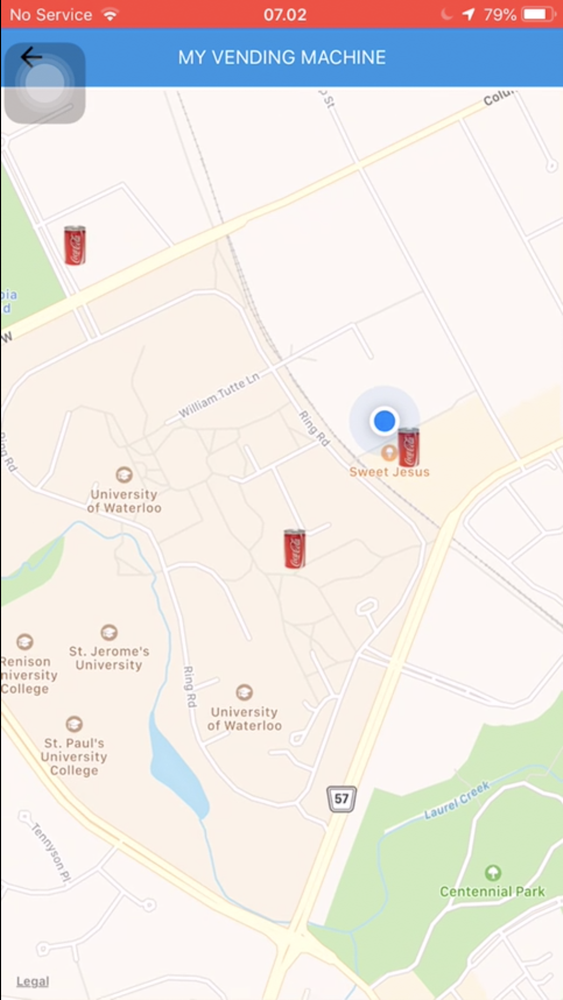

# Snackdar

Snackdar is an easy to use cross-platform mobile application that allows you to find the nearest vending machine according to your needs!

## Motivation

The idea came out while I was wondering around and struggling to find a vending machine in order to get my most favourite snack.

## Demo

To see the demo video, feel free to visit this link, [snackdar](https://drive.google.com/file/d/1oYl2-4UKwBzu3oB9v7RsZYMMiKySuXr5/view?usp=sharing)

Here are some screenshoots for your reference,

  
  
  
  

## Tech stacks

Snackdar was made mainly using React Native. We also utilized google firebase (realtime database) service as the backend to store data about different machines. In addition to that, the main feature of the app which is the mapscreen, was built on top of Google geolocation API.

## Future improvements

We were able to map real location of user using google geolocation API. However, for now the location of the vending machines are still hardcoded and aren't based on real life location. In the future, we hope to tackle this challenge and also add more items and categories to the app. 
